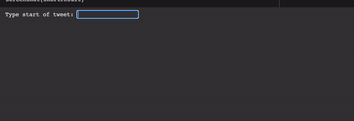

# troll-bot
Generates tweets similar to Russian trolls in the 2016 election.

This GPT2-based tweet generator is trained on a dataset released by FiveThirtyEight, containing tweets from accounts associated with an infamous Russian troll farm, the Internet Research Agency: https://www.kaggle.com/fivethirtyeight/russian-troll-tweets

To run the code yourself, download the zip file from Kaggle, extract it, and copy the local paths to the relevant variables at the start of the Jupyter notebook.

This is how it looks in action:

Keep in mind that the resulting tweets can be highly problematic.
